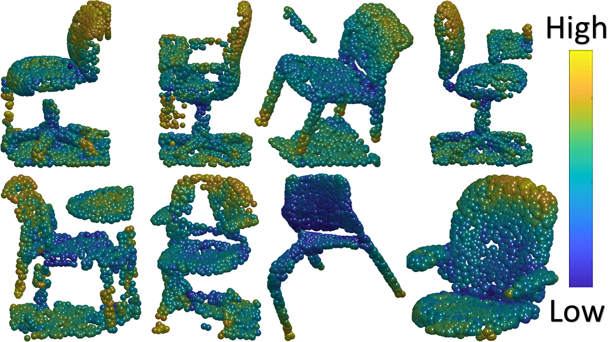

# Robustifying Point Cloud Networks By Refocusing 

Official pytorch implementation of the paper "Robustifying Point Cloud Networks by Refocusing".




We propose a fast and accurate approach to classify point-clouds. Our approach can be implanted to any existing classification network.
We show superiority on robust classification and adversarial defense. We also leverage our method for XAI and outlier removal. 
Our method is based filtering the most prominent points. We achieve state-of-the-art results on [ModelNet-C](https://github.com/jiawei-ren/ModelNet-C) by combining our method with [EPiC](https://github.com/yossilevii100/EPiC) using [RPC](https://github.com/jiawei-ren/ModelNet-C) (mCE=0.476).

----
Tested on Ubuntu 20.04 LTS using python 3.8.10 

## Critical Points++ notebook:
A tutorial on Critical Points in general, and on our extensions - Discrete and Soft measures is here:

[](https://colab.research.google.com/drive/1xLl2asGdL1E0PZM7j6QhK3tCl08fBFHI)

## Get Started

### Step 0. Clone the Repo
```shell
git clone https://github.com/yossilevii100/refocusing.git
cd critical_points2
```

### Step 1. Set Up the Environment
Set up the environment by:
```shell
pip install pointnet2_ops_lib/.
```

### Step 2. Prepare Data
Download ModelNet-40 by:

```shell
cd data
wget https://shapenet.cs.stanford.edu/media/modelnet40_ply_hdf5_2048.zip
unzip modelnet40_ply_hdf5_2048.zip
cd ..
```

Alternatively, you may download [ModelNet40](https://shapenet.cs.stanford.edu/media/modelnet40_ply_hdf5_2048.zip) manually and extract it under `data`.

Download ModelNet-C by:
```shell
cd data
gdown https://drive.google.com/uc?id=1KE6MmXMtfu_mgxg4qLPdEwVD5As8B0rm
unzip modelnet_c.zip
cd ..
```
Alternatively, you may download [ModelNet40-C](https://drive.google.com/file/d/1KE6MmXMtfu_mgxg4qLPdEwVD5As8B0rm/view?usp=sharing) manually and extract it under `data`.

Make sure your data folders are as follows:

```
data
--- modelnet_c
------ list of h5 files
--- modelnet40_ply_hdf5_2048
------ list of h5 files
```

### Step 3.1 Download Pretrained Models - Robust Classiffication
Download pretrained models by
```shell
gdown https://drive.google.com/uc?id=1i6bb1_ddNjdiA4tC-9qTaUaw4Lbt9SBx
unzip robust_classification_checkpoint.zip -d pretrained
mv pretrained/robust_classification_checkpoint/*.* robust_classification/pretrained
```

### Step 3.2 Download Pretrained Models - Adversarial Defense
Download pretrained models by
```shell
gdown https://drive.google.com/file/d/1xTeDtc9SUyrCodhEhP5K3TOTy3Ons_AO/view?usp=sharing
unzip shape_invariant_checkpoint.zip -d pretrained
mv pretrained/shape_invariant_checkpoint/*.* shape_invariant_attack/checkpoint/ModelNet40
```


Alternatively, you may download [Robust Classiffication pretrained models](https://drive.google.com/file/d/1KLtzO3tsbo29qL65f9celYE4HKaUMMsb/view?usp=drive_link) manually and extract it under root directory.

## RUN
### Robust Classification
Robust Classification RUN (only critical points++):
```shell
python main.py --model dgcnn --eval
```
Robust Classification RUN (with EPiC):
```shell
python main.py --model dgcnn --eval --use_ensemble --use_ensemble_all
```

### Adversarial Defense
Adversarial Defense RUN:
```shell
python main.py --dataset ModelNet40 --data_path /path/to/data/.../modelnet40_normal_resampled/ --query_attack_method ours  --surrogate_model dgcnn --target_model dgcnn_critical --step_size 0.32
```

## Results on ModelNet-C
Our method achieves SOTA results on ModelNet-C, with and without augmentation.
Moreover, our approach is improved each of the examined networks in terms of robustness.

| Method          | Reference                                                  |  mCE  | Clean OA |
| --------------- | ---------------------------------------------------------- | :---: | :------: |
| DGCNN           | [Wang et al.](https://arxiv.org/abs/1801.07829)            | 0.590 |   0.932  |
| DGCNN-EPiC      | [Wang et al.](https://arxiv.org/abs/1801.07829)            | 0.529 |   0.921  |
| DGCNN-EPiC+CP++ | [Wang et al.](https://arxiv.org/abs/1801.07829)            | 0.484 |   0.929  |
| --------------- | ---------------------------------------------------------- | :---: | :------: |
| GDANet          | [Xu et al.](https://arxiv.org/abs/2012.10921)              | 0.571 |   0.934  |
| GDANet-EPiC     | [Xu et al.](https://arxiv.org/abs/2012.10921)              | 0.530 |   0.925  |
| GDANet-EPiC+CP++| [Xu et al.](https://arxiv.org/abs/2012.10921)              | 0.493 |   0.928  |
| --------------- | ---------------------------------------------------------- | :---: | :------: |
| RPC             | [Ren et al.](https://arxiv.org/abs/2202.03377) 	           | 0.601 |   0.933  |
| RPC-EPiC        | [Ren et al.](https://arxiv.org/abs/2202.03377) 	           | 0.501 |   0.927  |
| RPC-EPiC+CP++   | [Ren et al.](https://arxiv.org/abs/2202.03377) 	           | 0.476 |   0.929  |


## Acknowledgement
This codebase heavily borrows codes from the following repositories:
- [ModelNet-C](https://github.com/jiawei-ren/ModelNet-C)
- [DGCNN](https://github.com/WangYueFt/dgcnn/tree/master/pytorch)
- [GDANet](https://github.com/mutianxu/GDANet)
- [PointNet](https://github.com/charlesq34/pointnet)
- [Shape-Invariant-Attack](https://github.com/shikiw/SI-Adv)
- [RSMix](https://github.com/dogyoonlee/RSMix)
- [PointWOLF](https://github.com/mlvlab/PointWOLF)
- [EPiC](https://github.com/yossilevii100/EPiC)


